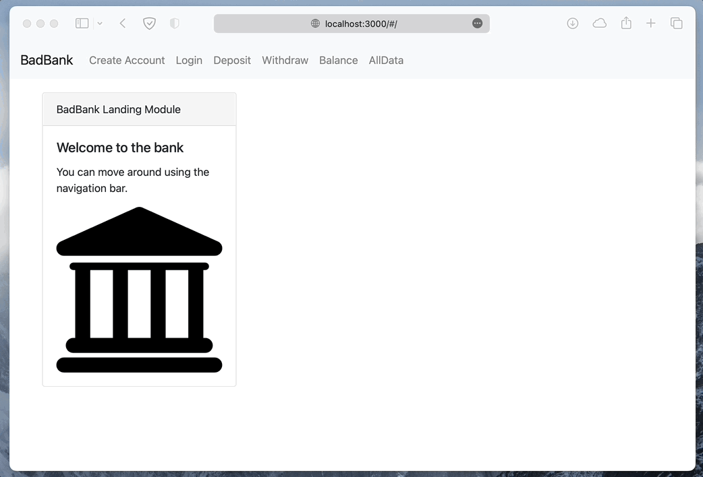

# Project Title: MIT Bad bank with React and Mongo DB

## Description/Motivation

The MIT Bad bank with React and Mongo DB is a proof of concept app with React and MongoDB. It was built to enhance my learning about a fully three tiered full-stack application.

The app is a simple banking app that allows users to create accounts, deposit and withdraw funds, and view their account balance. The app is built with React, Node, Express, and MongoDB.

## Installation Guidelines

To get started, follow these steps:

1. Clone this repository.
2. Install the required dependencies using `npm install`.
3. Start the development server using `node index.js`.
4. Open your browser to localhost:3000.

## Screenshot

## Technology used (MERN Stack)

- MongoDB
- Express
- React JS
- Node JS

## Features

- Create an account
- Update a balance
- See all users

Future features:

- Authentication
- Better UI styling
- Host on Firebase

## License

MIT Bad bank with React and Mongo DB is licensed under the MIT License.
